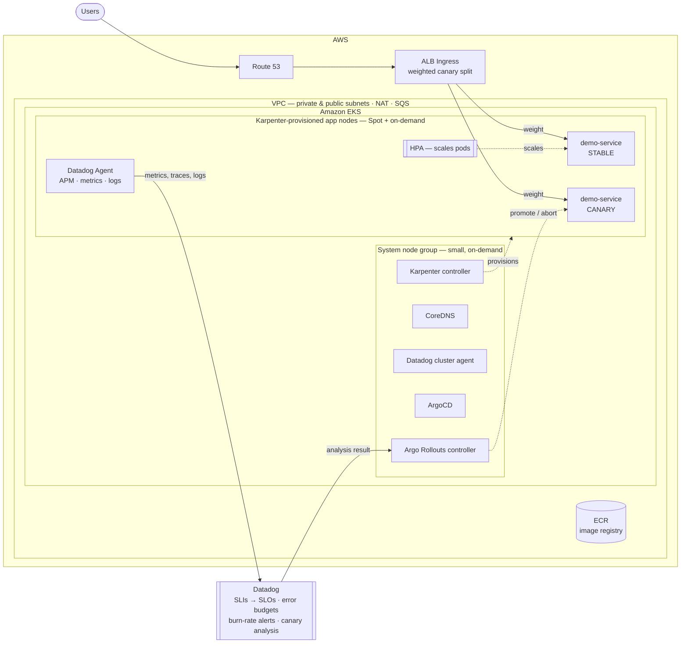
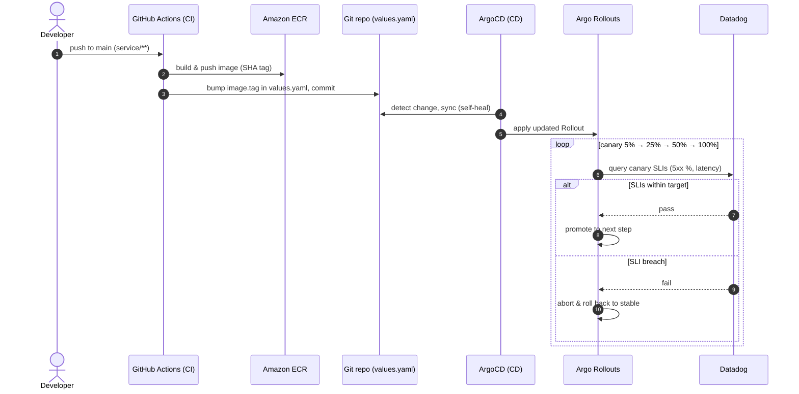

# SRE Reliability Platform — AWS · EKS · Karpenter · Terraform · Datadog · ArgoCD

A hands-on, deployable reference project that demonstrates a production-grade Site
Reliability Engineering stack. It ships a containerized demo microservice onto
**Amazon EKS**, provisions all infrastructure with **Terraform** (IaC), scales nodes
just-in-time with **Karpenter**, delivers changes via **GitOps** (ArgoCD) with an
**SLO-gated canary** (Argo Rollouts), and implements **SLIs / SLOs / error budgets**
and alerting with **Datadog**.

> The demo service models a multi-tenant SaaS API. Its endpoints produce realistic
> latency, error, and traffic signals so there are genuine SLIs to measure and alert on.

---

## What this project demonstrates

| Capability | Where it shows up |
|---|---|
| Define SLIs/SLOs and error budgets | `terraform/40-observability` (Datadog SLOs + burn-rate monitors) |
| Cloud infrastructure on AWS as code | `terraform/10-foundation`, `terraform/20-eks` |
| Container orchestration | Amazon EKS + a Helm chart in `charts/demo-service` |
| Just-in-time node autoscaling | `terraform/25-karpenter` + `karpenter/` NodePools |
| Observability (metrics, traces, logs) | Datadog Agent via `terraform/30-datadog-agent` |
| GitOps delivery | ArgoCD in `terraform/50-argocd` (app-of-apps) |
| SLO-gated progressive delivery | Argo Rollouts canary + Datadog analysis (`charts/demo-service`) |
| Deployment safety / zero-downtime | Canary, auto-rollback, PDBs, readiness gates (`docs/deployment-safety.md`) |
| Scalability under load | `loadtest/` (k6) + `docs/scalability.md` |
| Operational excellence | `docs/runbook.md`, `docs/incident-response.md` |
| Multi-tenant SaaS patterns | Tenant-aware service with per-tenant SLI tagging |
| Clean, instrumented application code | `service/` (Python FastAPI) |

---

## Architecture

### System architecture



### Delivery flow (GitOps + SLO-gated canary)



## Repo layout

```
SRE/
├── README.md
├── service/                     # Containerized demo microservice (FastAPI)
├── charts/demo-service/         # Helm chart (Rollout, services, ingress, HPA, PDB, analysis)
├── karpenter/                   # Karpenter NodePool + EC2NodeClass manifests
├── loadtest/                    # k6 load test (script + in-cluster Job)
├── terraform/
│   ├── 00-remote-state/         # S3 + DynamoDB backend bootstrap
│   ├── 10-foundation/           # VPC, subnets, NAT, ECR
│   ├── 20-eks/                  # EKS cluster + small system node group + ALB controller
│   ├── 25-karpenter/            # Karpenter controller, IAM, SQS interruption queue
│   ├── 30-datadog-agent/        # Datadog Agent via Helm
│   ├── 40-observability/        # Datadog SLOs, error budgets, monitors, dashboard
│   └── 50-argocd/               # ArgoCD + Argo Rollouts + app-of-apps
├── .github/workflows/           # CI: build/push image + GitOps values bump
└── docs/
    ├── slo-design.md            # SLI/SLO/error-budget methodology
    ├── deployment-safety.md     # canary, rollback, zero-downtime
    ├── scalability.md           # HPA + Karpenter autoscaling loop
    ├── runbook.md               # operational runbook
    └── incident-response.md     # incident command process
```

---

## What is a Helm chart (and how this repo uses it)

A **Helm chart** is a package of templated Kubernetes manifests plus a set of
default values, bundled so an application can be installed, upgraded, versioned,
and rolled back as a single unit. Helm is the de-facto *package manager for
Kubernetes*: if `apt` or `npm` installs software onto a machine, Helm installs
an app onto a cluster.

Without Helm you hand-write and `kubectl apply` a pile of YAML (Deployment,
Service, Ingress, HPA, PDB, …), copy-pasting the same image name and port into
each file and keeping near-duplicate copies per environment. A chart replaces
that with **templates driven by one values file**:

```
templates/ (with {{ placeholders }})  +  values.yaml  --helm-->  rendered Kubernetes YAML  -->  cluster
```

**What a chart is used for**

- **Packaging** — ship an app as one versioned artifact instead of loose YAML.
- **Templating / reuse** — define the pod spec once and reuse it everywhere.
- **Environment config** — same chart, different `values.yaml` for dev vs. prod.
- **Lifecycle** — `helm install` / `upgrade` / `rollback` manage tracked releases.
- **Conditional resources** — toggle whole objects on/off from values.

**Two distinct ways Helm appears in this project**

1. **A chart authored here — `charts/demo-service/`.** The demo app is packaged
   as a chart that ArgoCD renders and deploys. Its layout:

   ```
   charts/demo-service/
   ├── Chart.yaml                 # name, version, appVersion
   ├── values.yaml                # image, replicas, HPA range, canary steps, DD tags
   └── templates/
       ├── _helpers.tpl           # name/label helpers + Datadog unified tags
       ├── _podspec.tpl           # shared pod spec (container, probes, DD annotations)
       ├── rollout.yaml           # Argo Rollout (canary) OR Deployment fallback
       ├── service.yaml           # stable + canary Services (or a single Service)
       ├── ingress.yaml           # ALB Ingress
       ├── hpa.yaml               # HorizontalPodAutoscaler (CPU 60%)
       ├── pdb.yaml               # PodDisruptionBudget (minAvailable 2)
       └── analysistemplate.yaml  # Datadog SLO analysis that gates the canary
   ```

   One pod spec (`_podspec.tpl`) is shared by both the Rollout and the plain
   Deployment fallback, and `{{- if .Values.rollout.enabled }}` switches the
   whole chart between progressive-delivery and vanilla modes.

2. **Third-party charts installed by Terraform.** The platform components are
   public charts installed via the Terraform Helm provider (`helm_release`):
   the AWS Load Balancer Controller (`20-eks`), Karpenter (`25-karpenter`), the
   Datadog Agent (`30-datadog-agent`), and ArgoCD + Argo Rollouts (`50-argocd`).

Render the demo chart to the exact manifests it produces, without deploying:

```bash
helm template demo-service charts/demo-service
```

---

## Scaling model (two axes)

| Axis | Component | Trigger |
|---|---|---|
| Pods | HorizontalPodAutoscaler | CPU > 60% |
| Nodes | **Karpenter** (not Cluster Autoscaler) | unschedulable pods |

A small **system** node group runs only cluster-critical workloads (Karpenter, CoreDNS,
Datadog cluster agent, ArgoCD). **Karpenter** provisions all application capacity
just-in-time — picking the cheapest instance that fits pending pods (Spot preferred) —
and consolidates nodes away when load drops. See `docs/scalability.md`.

## Delivery model (GitOps + SLO-gated canary)

1. **CI** builds the image, pushes to ECR, and bumps `image.tag` in the chart's
   `values.yaml` — a Git commit. CI does **not** deploy.
2. **ArgoCD** detects the change and syncs the cluster to match Git (self-healing).
3. **Argo Rollouts** rolls the new version out as a canary (5% → 25% → 50% → 100%).
   Between steps it runs a **Datadog analysis** against the canary's SLIs and
   **auto-aborts/rolls back** if availability or latency breaches. See
   `docs/deployment-safety.md`.

## SLO summary

| Journey | SLI | Target | Window | Error budget |
|---|---|---|---|---|
| API availability | % of requests not 5xx | 99.9% | 30d rolling | ~43m 50s / 30d |
| API latency | % of requests < 300ms | 99.0% | 30d rolling | ~7h 18m / 30d |

Burn-rate alerts page on fast burn (2% of budget in 1h) and ticket on slow burn
(10% in 3 days). See `docs/slo-design.md`.

---

## Deploy order (quick start)

Prereqs: AWS CLI configured, `terraform >= 1.5`, `kubectl`, `helm`, Docker, a Datadog
account (API + APP keys), and this repo pushed to a Git remote ArgoCD can read.

```bash
# 0. Remote state (one-time) — then copy the bucket/table into each layer's backend block.
cd terraform/00-remote-state && terraform init && terraform apply

# 1. Foundation (VPC + ECR)
cd ../10-foundation && terraform init && terraform apply

# 2. EKS (control plane + small system node group + ALB controller)
cd ../20-eks && terraform init && terraform apply -var "state_bucket=<STATE_BUCKET>"
aws eks update-kubeconfig --name sre-demo --region $AWS_REGION

# 3. Karpenter (controller + IAM + SQS), then apply the NodePools
cd ../25-karpenter && terraform init && terraform apply -var "state_bucket=<STATE_BUCKET>"
ROLE=$(terraform output -raw karpenter_node_iam_role_name)
sed "s/REPLACE_WITH_KARPENTER_NODE_ROLE/$ROLE/" ../../karpenter/ec2nodeclass.yaml | kubectl apply -f -
kubectl apply -f ../../karpenter/nodepool-app.yaml

# 4. Datadog Agent
cd ../30-datadog-agent && terraform init \
  && terraform apply -var "datadog_api_key=$DD_API_KEY" -var "datadog_app_key=$DD_APP_KEY"

# 5. ArgoCD + Argo Rollouts (point it at your Git repo)
cd ../50-argocd && terraform init && terraform apply \
  -var "git_repo_url=<YOUR_REPO_URL>" \
  -var "datadog_api_key=$DD_API_KEY" -var "datadog_app_key=$DD_APP_KEY"
#    ArgoCD now syncs charts/demo-service automatically. The first CI run (or a manual
#    values.yaml image bump + push) sets the real image and triggers the canary.

# 6. SLOs + monitors + dashboard
cd ../40-observability && terraform init \
  && terraform apply -var "datadog_api_key=$DD_API_KEY" -var "datadog_app_key=$DD_APP_KEY"
```

Then drive load to see the autoscaling + SLOs in action (`docs/scalability.md`):
```bash
ALB=$(kubectl -n demo get ingress -o jsonpath='{.items[0].status.loadBalancer.ingress[0].hostname}')
BASE_URL="http://$ALB" k6 run loadtest/load.js
```

---

## Cost & teardown

Real billable resources: EKS control plane, NAT gateway, EC2 (system + Karpenter nodes,
some Spot), ALB, SQS. **Tear down in reverse order:**

```bash
cd terraform/40-observability && terraform destroy
cd ../50-argocd               && terraform destroy
kubectl delete -f karpenter/nodepool-app.yaml          # let Karpenter drain its nodes first
cd ../30-datadog-agent        && terraform destroy
cd ../25-karpenter            && terraform destroy
cd ../20-eks                  && terraform destroy
cd ../10-foundation           && terraform destroy
```
